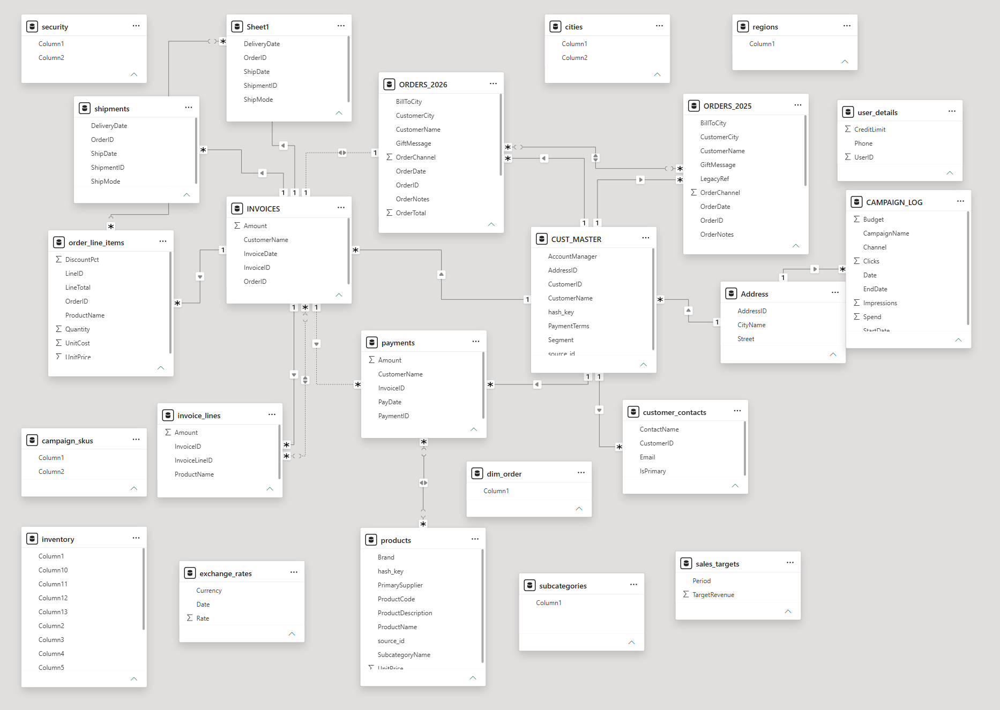
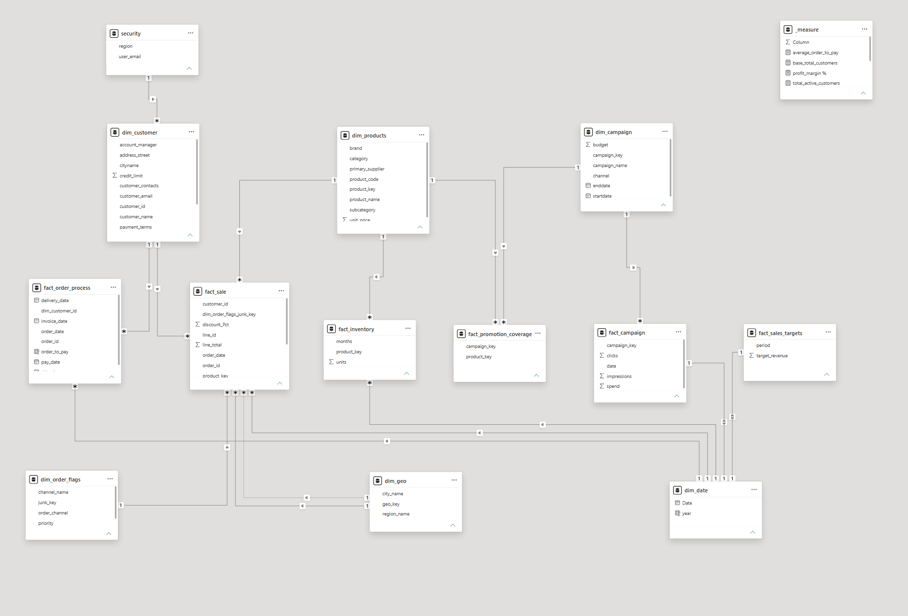
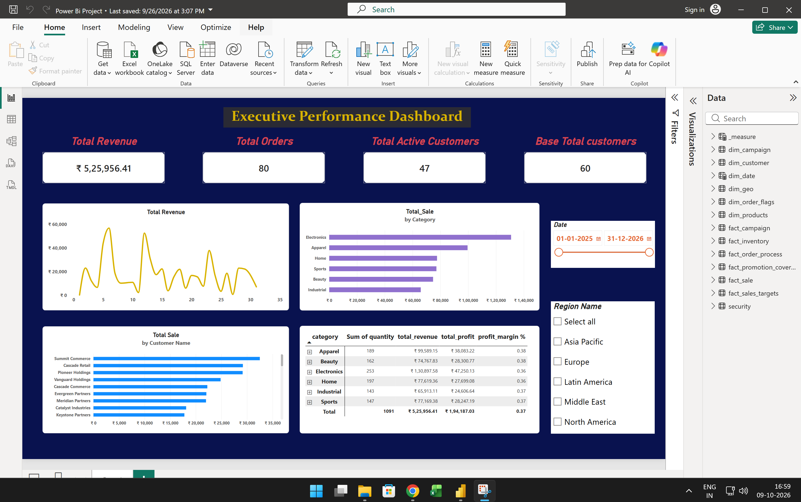

# Complex Data Model Refactoring

## 📌 Business Overview
In many legacy enterprise environments, transactional databases (OLTP) are directly imported into reporting tools without structural transformation. This project demonstrates the step-by-step refactoring of a complex, highly fragmented relational data structure into a clean, performant **Star Schema** designed for analytical reporting in Power BI.

## 🏗️ Architectural Transformation

### 1. Initial State: Fragmented Relational Schema
The initial raw dataset contained circular relationships, many-to-many (`*:*`) cardinalities, ambiguous filter paths, and redundant normalized tables.

### 2. Target State: Optimized Star Schema
The refactored model separates numerical facts from descriptive dimensions, establishing clear single-direction filter propagation (`1:*`) and explicit role-playing dimensions.

## 🎯 Key Technical Challenges & Solutions

### 1. 🔄 Resolving Circular Filter Paths & Ambiguous Many-to-Many Relationships
* **Challenge:** The raw transactional schema contained circular relationships and many-to-many (`*:*`) cardinalities across normalized tables, causing unpredictable measure evaluation and filter context leakage.
* **Solution:** Re-architected the table relationships into a clean Star Schema, replacing direct table-to-table links with unified dimension tables and single-direction (`1:*`) filter propagation.

### 2. 📅 Handling Multi-State Date Relationships Without Model Ambiguity
* **Challenge:** Linking multiple milestone timestamps (Order Date, Ship Date, and Delivery Date) to a single calendar table created competing active relationship paths.
* **Solution:** Configured inactive relationships within the model and dynamically invoked specific date pathways using DAX `USERELATIONSHIP` logic inside targeted measures.

## 📸 Dashboard Preview

